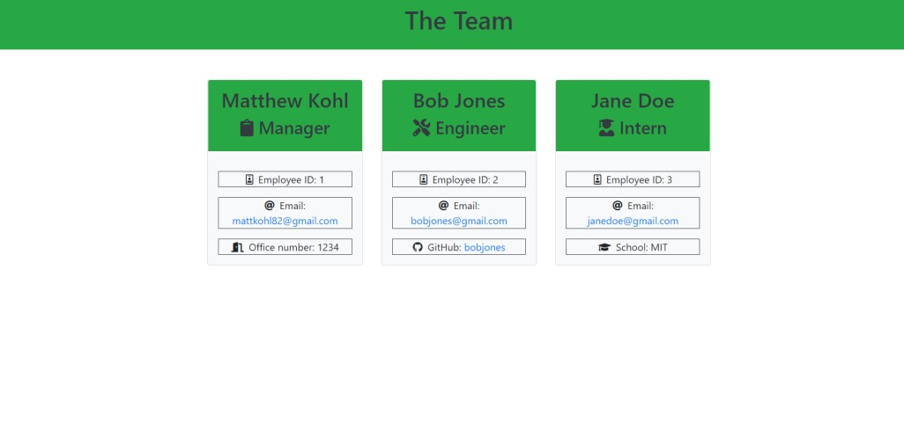
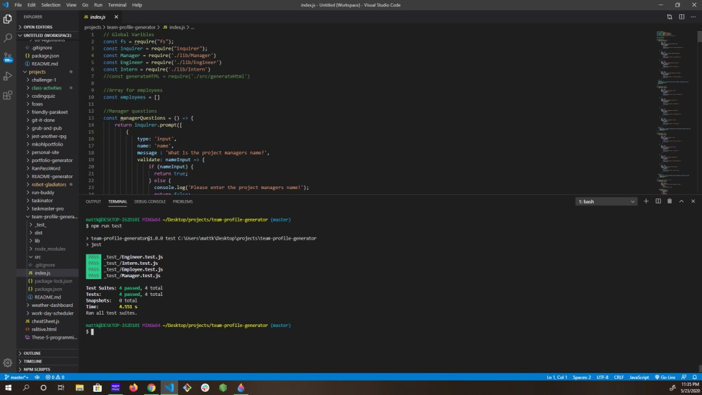

<h1 align="center">Team Profile Generator Using Node.js</h1>

<p align="center">


</p>

<p align="center">

</p>


## Table of Contents
- [Description](#description)
- [Installation](#install)
- [Usage](#usage)
- [Tests](#tests)
- [Questions](#questions)

## Description
### This node.js application that will help you build a quick portfolio for you and your team.

## Install
```
`npm init`
  
`npm install inquirer`  

`npm install jest --save-dev`
```
## Usage
### A Project manager will be able to use this application to create a quick and easy place to store all the Team Members information. Everything from name, ID, and will be for all memebers with various others for specific job titled members.
          
## Tests
```
`npm run test`
```
### When run it will test the four Classes: Employee, Manager, Engineer, and Intern.

## Questions
### [Mattkohl82 for GitHub](https://github.com/Mattkohl82)  
### mattkohl82@gmail.com for ✉️ email 

### Below is a link to the GitHub repository   
[Team Profile Generator](https://github.com/mattkohl82/team-profile-generator)  

### Below is a link to a video of me demostrating the application  
[Link to the Raw Github Version]()  
[Youtube version](https://youtu.be/csGkkxbtw3Y)


### Belowe are two screen shots of the code  

 
